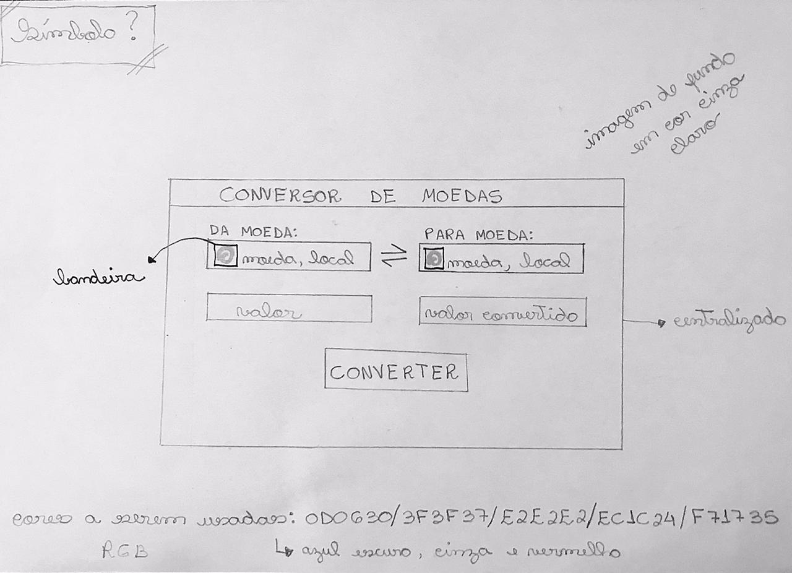

# Currency Converter :moneybag: :currency_exchange:

## Objetivo
### Este projeto visa aprimorar alguns conhecimentos relacionados às linguagens web e contribuir para novas aprendizagens. O foco principal será trabalhar com inserção de comportamento em códigos HTML.

## Versão 0
### A versão inicial compreende em um conversor de câmbio trabalhando somente com as moedas Real e Dólar. 

## RabiscoFrame V0: 
 
